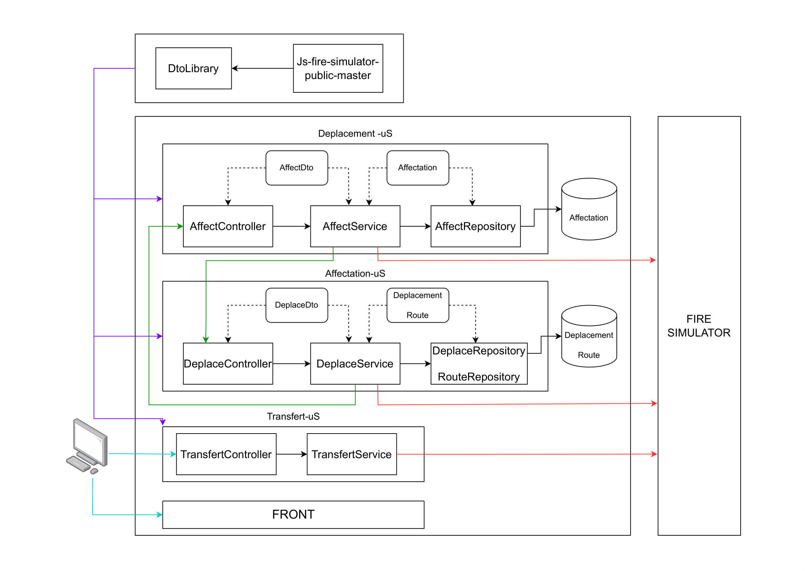

# Installation des bases de données

1. Assurez-vous d'avoir Docker installé sur votre machine
2. Récupérez le fichier docker-compose.yml à la racine du projet
3. Placez-vous dans même répertoire que le fichier et lancer la commande suivante:

```bash
docker-compose up
```

# Lancement des microservices et du reverse-proxy

Lancez les launchers java des microservices. Attention veillez à bien **lancer le microservice déplacement avant le microservice affectation** car ce dernier démarre en faisant des requêtes au microservice déplacement.

# Accès à l'application

Tapper **[http://localhost:8082](http://localhost:8082)** dans votre navigateur

# Vidéo demo du site

[https://www.youtube.com/watch?v=icd8c6oSYP8](https://www.youtube.com/watch?v=icd8c6oSYP8)

# Architecture


